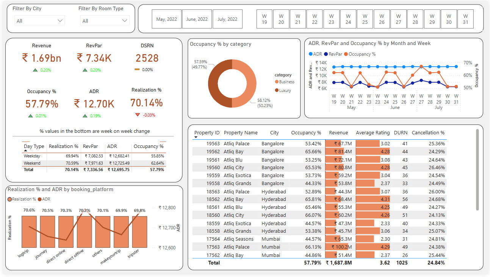

# 🏨 End-to-End Data Analytics Project | Power BI | Hospitality Domain

## 📊 Project Overview
This project provides an **in-depth analysis of the hospitality industry** using Power BI. The dashboard visualizes key **performance indicators (KPIs)** such as **Revenue, RevPAR, ADR, Occupancy Rate, and Realization %**, helping hotel managers and stakeholders make data-driven decisions.

## 🎯 Key Insights
- **📈 Revenue:** ₹1.69bn with week-over-week growth of **0.20%**.
- **🏨 Occupancy Rate:** **57.79%**, showing a **0.01% increase**.
- **💰 ADR (Average Daily Rate):** ₹12.70K, up by **0.19%**.
- **💵 RevPAR (Revenue per Available Room):** ₹7.34K.
- **📉 Cancellation Rate:** **24.84%**, indicating guest booking behavior.
- **🛏️ Booking Platform Performance:** Realization % and ADR by different platforms like **LogTrip, Journey, Direct Online, etc.**.

## 📌 Dashboard Preview

## 📂 Data Sources
- **Bookings Data:** Room type, booking platform, check-in/check-out dates.
- **Revenue Data:** Monthly and weekly revenue insights.
- **Customer Data:** Ratings, city-wise occupancy, cancellation %, and DURN (duration of stay).

## 🛠️ Tools Used
- **Power BI** (for visualization)
- **Excel/CSV** (for raw data processing)
- **Power Query** (for data transformation)

## 🚀 How to Use
1. **Download the `.pbix` file** from this repository.
2. Open it in **Power BI Desktop**.
3. Connect to the dataset (if required).
4. Explore the visualizations and interact with the filters.

📥 **Download Report:** [hospitality_dashboard.pbix](https://github.com/Soban-2004/Power-BI-Project-Hospitality-Domain/hotels.pbix)   

## 📌 Conclusion
This Power BI project provides actionable insights for the **hotel industry**, helping stakeholders optimize revenue, improve occupancy rates, and enhance guest experiences.

